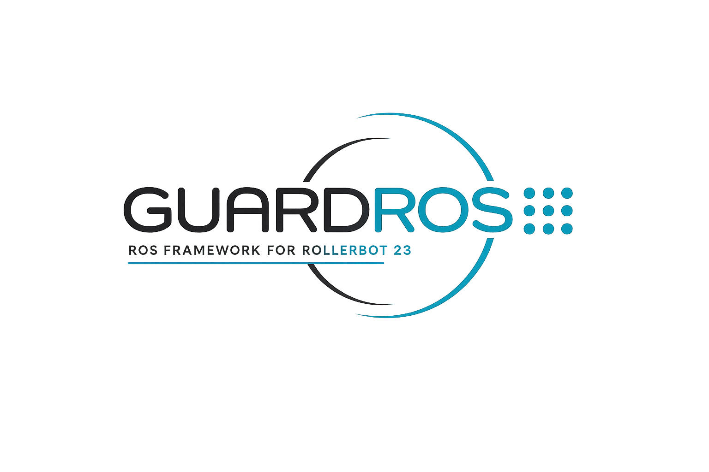

# GuardROS

> **A Non-Invasive ROS 2 Integration Framework for the GuardBot RollerBot 23 (RB23)**

---

<p align="center">
    <picture>
  <source media="(prefers-color-scheme: dark)" srcset="Images/logo_dark.png" width="50%">
  <source media="(prefers-color-scheme: light)" srcset="Images/logo_light.png" width="50%">
  
    </picture>
</p>

<p align="center">
  ROS 2 • Teleoperation • Telemetry • Multimedia Streaming • Experiment Logging
</p>

---

## Overview

GuardROS is a non-invasive ROS 2 interoperability framework developed for the **GuardBot RollerBot 23 (RB23)** platform.

The framework acts as a middleware integration layer capable of bridging the proprietary RB23 communication ecosystem with modular ROS 2 workflows **without requiring modifications to the original firmware or hardware**.

GuardROS enables:

- ROS 2 teleoperation
- Real-time telemetry acquisition
- Video streaming
- Bidirectional audio communication
- Experimental logging
- ROS 2 topic integration
- Middleware-based extensibility
- Future autonomous robotics integration

The framework was experimentally validated under real-world operational conditions, demonstrating stable bidirectional communication, multimedia integration, and long-duration operational stability.

---

# System Architecture

<p align="center">
  <!-- ARCHITECTURE IMAGE PLACEHOLDER -->
  
</p>

GuardROS operates as a bidirectional interoperability layer between:

- The proprietary GuardBot communication infrastructure
- ROS 2 applications and robotics workflows

The framework decodes telemetry, video, audio, and operational packets from the RB23 platform and exposes them as ROS 2-compatible interfaces and topics.

It also supports the inverse communication flow, allowing ROS 2 nodes to send teleoperation and autonomous control commands back to the robot.

---

# Features

## Core Capabilities

- ROS 2 interoperability
- Modular architecture
- Real-time teleoperation
- Structured telemetry access
- Multimedia streaming
- Bidirectional audio
- Experiment logging
- Reproducible experimentation

## ROS 2 Integration

- ROS 2 topic mapping
- Middleware-based communication
- External tool compatibility
- Distributed robotics workflows

## Future Extensions

GuardROS was designed to support future robotics applications such as:

- SLAM
- Nav2
- Computer vision
- Sensor fusion
- Autonomous navigation
- Distributed robotic systems

---

# Workspace Structure

```bash
guardros_ws/
├── scripts/
│   ├── run_guardros.sh
│   └── stop_guardros.sh
│
├── experiments/
│   ├── logs/
│   └── analysis/
│       └── analyze_guardros_logs.py
│
├── src/
├── build/
├── install/
└── log/
```

---

# Requirements

## Recommended Environment

- Ubuntu 22.04
- ROS 2 Humble
- Python 3
- GuardBot RollerBot 23 (RB23)

---

# Installation

## 1. Clone the Repository

```bash
git clone https://github.com/<your-repository>/guardros.git
```

## 2. Build the Workspace

```bash
cd guardros_ws

colcon build
```

## 3. Source the Workspace

```bash
source install/setup.bash
```

---

# Configuration

Before running GuardROS, configure the workspace path inside:

```bash
~/guardros_ws/scripts/run_guardros.sh
```

Locate:

```bash
WORKSPACE="/home/your_user/guardros_ws"
```

Replace it with your actual workspace path.

Also verify the ROS 2 installation path:

```bash
ROS_SETUP="/opt/ros/humble/setup.bash"
```

---

# Running GuardROS

## Make Scripts Executable

```bash
chmod +x scripts/run_guardros.sh
chmod +x scripts/stop_guardros.sh
```

## Start the Framework

```bash
./scripts/run_guardros.sh
```

The script will request the `ROBOT_ID`.

After initialization, multiple terminals are automatically launched, including:

- RB23 Driver
- Keyboard Teleoperation
- Video Viewer
- Telemetry Viewer
- Audio Node
- Experiment Logger

---

# Logging System

Experiment logs are automatically stored at:

```bash
~/guardros_ws/experiments/logs/
```

Each session creates a timestamped directory containing logs such as:

```bash
control_log.csv
telemetry_log.csv
video_log.csv
audio_log.csv
typed_telemetry_log.csv
diagnostics_driver_log.jsonl
```

---

# Analysis Tools

GuardROS includes an analysis utility:

```bash
experiments/analysis/analyze_guardros_logs.py
```

The script generates:

- Statistical summaries
- Timing analysis
- Jitter analysis
- Battery plots
- Temperature plots
- Ping plots
- PNG figures

## Example Usage

```bash
python3 experiments/analysis/analyze_guardros_logs.py \
experiments/logs/SESSION_NAME
```

---

# Experimental Validation

The framework was experimentally validated across multiple operational scenarios:

| Test | Objective |
|---|---|
| T1 | Idle stability validation |
| T2 | Teleoperation validation |
| T3 | Video stress validation |
| T4 | Audio stress validation |
| T5 | Long-duration operational validation |
| T6 | Native application comparison |

Results demonstrated:

- Stable 20 Hz command stream
- Stable telemetry acquisition
- Stable ~20 FPS video streaming
- No UDP reception errors
- Sustained operation without manual reconnection

---

# Comparison with Native RB23 Ecosystem

| Capability | Native Apps | GuardROS |
|---|---|---|
| ROS 2 interoperability | No | Yes |
| ROS topic integration | No | Yes |
| Structured telemetry access | Limited | Yes |
| Experimental logging | No | Yes |
| Middleware integration | No | Yes |
| Autonomous robotics integration | No | Supported |

---

# Recommended Workflow

1. Power on the RB23 robot
2. Wait for network connection
3. Run GuardROS
4. Perform experiments
5. Stop GuardROS
6. Analyze generated logs

---

# Current Limitations

The current implementation still depends on the original proprietary GuardBot communication infrastructure and server ecosystem.

Future work aims to reduce this dependency through direct or embedded communication architectures.

---

# Future Work

Planned future developments include:

- Embedded communication architectures
- Direct robot communication
- SLAM integration
- Nav2 support
- Sensor fusion pipelines
- Autonomous robotics workflows
- Distributed robotic systems

---

# Citation

If you use GuardROS in academic work, please cite:

```bibtex
@article{guardros2026,
  title={GuardROS: A Non-Invasive ROS 2 Integration Framework for the GuardBot RollerBot 23},
  author={Mosconi, Denis and Marsicano, Joao Aires and Becker, Marcelo},
  journal={IEEE},
  year={2026}
}
```

---

# License

```text
[Choose your license]
MIT / Apache-2.0 / GPL-3.0
```

---

# Authors

- Denis Mosconi
- Joao Aires Marsicano
- Marcelo Becker

---

# Acknowledgements

This work was carried out with the support of Petrobras, with resources from the ANP R&D clause, in partnership with the University of São Paulo (USP) and FAFQ.

---

# Repository Structure Suggestions

```bash
docs/
├── images/
│   ├── logo.png
│   ├── architecture.png
│   └── rb23.png
```
